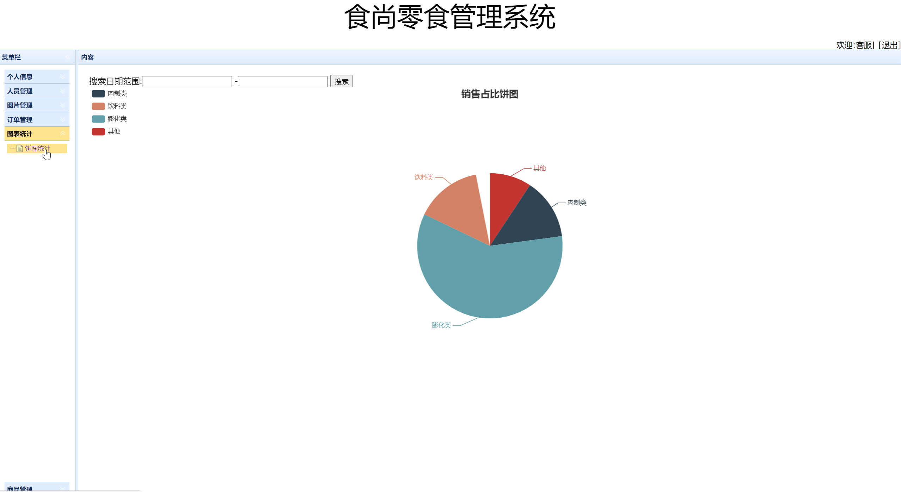

## 基于SSM框架的零食在线商城管理系统

###  获取sql数据库文件: 从戎源码网 (https://armycodes.com/) QQ: 386869957 QQ群: 377586148
###  所有系统地址: (https://github.com/YuLin-Coder/AllProjectCatalog) 
###  所有项目以及源代码本人均调试运行无问题 可支持远程安装部署调试、定制修改、代码讲解

## 项目介绍
基于SSM框架的零食在线商城管理系统，有用户和管理员两个角色，主要功能如下
用户：
1. 注册登录：用户可以通过注册账号并登录系统，享受个性化的购物体验。
2. 食品分类浏览：用户可以按照不同的食品分类进行浏览和搜索所需商品。
3. 购物车：用户可以将选购的商品加入购物车，便于统一管理和结算。
4. 下单：用户可以选择商品、填写收货地址等信息，生成订单并进行支付。
5. 我的订单：用户可以查看自己的订单详情、订单状态、物流信息等。
6. 个人中心：用户可以查看和编辑个人信息、修改密码、管理收货地址等。

普通管理员：
1. 个人信息：管理员可以查看和编辑自己的个人信息。
2. 人员管理：管理员可以管理系统中的用户信息，包括添加新用户、编辑用户信息
3. 商品管理：管理员可以管理商城的商品信息，包括添加新商品、编辑商品信息、下架商品等。
4. 订单管理：管理员可以查看和处理用户的订单，包括确认订单、发货、退货等操作。
5. 图表统计：管理员可以查看销售数据、用户数据等的统计图表

超级管理员：
1. 系统管理：超级管理员拥有系统的最高权限，可以管理系统的设置、配置和权限控制等。
2. 人员管理：超级管理员可以管理管理员账号，包括添加新管理员、编辑管理员信息、删除管理员等。
3. 商品管理：超级管理员可以管理商城的商品信息，包括添加新商品、编辑商品信息、删除商品等。
4. 订单管理：超级管理员可以查看和处理用户的订单，包括确认订单、发货、退货等操作。
5. 统计分析：超级管理员可以查看销售数据、用户数据等的统计分析报表

## 项目技术
- 编程语言：Java
- 数据库：MySQL
- 前端技术：JSP、JavaScript、jquery、bootstrap
- 后端技术：Spring、SpringMVC、MyBatis

## 运行环境
- JDK版本：JDK1.8及以上
- 开发工具：IDEA、Ecplise、Myecplise都可以
- 数据库: MySQL5.7及以上
- Maven：maven3.0及以上

## 运行截图

